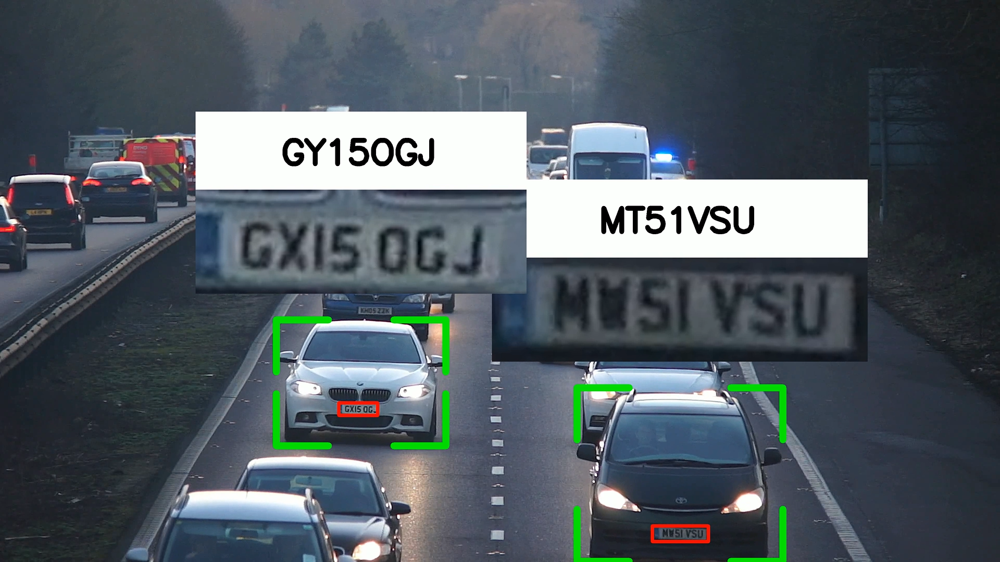

# Vehicle Tracking and License Plate Recognition System

This project implements a vehicle tracking and license plate recognition system using YOLO for object detection, SORT for object tracking, and EasyOCR for reading license plates. The system processes video input to detect vehicles, track them across frames, and extract license plate information.

## Features
- **Vehicle Detection**: Identifies vehicles such as cars and trucks in video frames using YOLOv8.
- **Vehicle Tracking**: Assigns unique IDs to detected vehicles and tracks their movement across frames using the SORT algorithm.
- **License Plate Detection**: Detects license plates from the frames using a custom YOLO model.
- **License Plate Recognition**: Extracts text from detected license plates using EasyOCR.
- **Result Export**: Saves the tracking and recognition results to a CSV file for further analysis.

---

## Workflow

1. **Load Models**:
   - Load a YOLOv8 model for general object detection (`coco_model`) and a custom YOLO model for license plate detection (`license_plate_detector`).

2. **Process Video**:
   - Read a video file frame by frame.
   - Detect vehicles using the YOLO model.
   - Use SORT to track vehicles across frames.

3. **License Plate Detection**:
   - Detect license plates in the frame.
   - Match detected license plates to tracked vehicles based on bounding box overlap.

4. **License Plate Recognition**:
   - Crop and preprocess the license plate region.
   - Use EasyOCR to extract the text from the license plate.

5. **Save Results**:
   - Store the vehicle tracking data and recognized license plate information.
   - Write the results to a CSV file.

---

## Folder Structure
```
├── main.py                      # Main script for vehicle tracking and license plate recognition
├── util.py                      # Helper functions (license plate matching, CSV writing, etc.)
├── sort/                        # Implementation of SORT algorithm
│   └── sort.py                  # SORT tracker code
├── models/                      # Folder for YOLO model files
│   ├── yolov8m.pt               # YOLOv8 model for general object detection
│   └── license_plate_detector_GPU_NOv6.pt  # Custom YOLO model for license plate detection
├── cars2.mp4                    # Sample video for processing
└── test.csv                     # CSV file to store results
```

---

## Key Components

### **1. Vehicle Detection**
Uses the YOLOv8 model to detect vehicles in video frames. Only specific COCO classes (e.g., cars, trucks) are retained for further processing.

### **2. Vehicle Tracking**
Tracks detected vehicles across frames using the SORT (Simple Online and Realtime Tracker) algorithm, which uses Kalman Filters and IoU-based assignment.

### **3. License Plate Detection and Recognition**
- **Detection**: A custom YOLO model is used to locate license plates in the frames.
- **Recognition**: License plate text is extracted using EasyOCR after preprocessing the detected region.

### **4. Result Saving**
Stores vehicle bounding boxes, license plate bounding boxes, recognized text, and associated scores in a structured format, and exports the data to a CSV file.

---

## How to Use

1. Clone this repository:
   ```bash
   git clone https://github.com/yourusername/vehicle-tracking-license-plate.git
   cd vehicle-tracking-license-plate
   ```

2. Install dependencies:
   ```bash
   pip install -r requirements.txt
   ```

3. Add YOLO model files to the `models/` folder:
   - `yolov8m.pt` (general object detection)
   - `license_plate_detector_GPU_NOv6.pt` (custom license plate detector)

4. Run the main script:
   ```bash
   python main.py
   ```

5. View results:
   - The tracking and recognition results will be saved in `test.csv`.

---

## Example Output

- **Input Video**: `cars2.mp4`
- **Output CSV**: A file containing vehicle IDs, bounding boxes, license plate texts, and detection scores.

| Frame | Vehicle ID | License Plate Text | Detection Score |
|-------|------------|--------------------|-----------------|
| 1     | 2          | ABC1234            | 0.95            |
| 1     | 3          | XYZ9876            | 0.92            |

---

## Dependencies
- Python 3.8+
- OpenCV
- YOLOv8 (via ultralytics)
- EasyOCR
- NumPy

---

## Acknowledgements
- [YOLO](https://github.com/ultralytics/yolov8) for object detection.
- [SORT](https://github.com/abewley/sort) for tracking.
- [EasyOCR](https://github.com/JaidedAI/EasyOCR) for text recognition.

--- 


### Additional Scripts for Data Interpolation and Visualization

#### **1. `add_missing_data.py`**
This script interpolates missing bounding boxes for vehicles and license plates across video frames. It ensures smooth and consistent tracking for objects even when detections are missing in some frames.

##### **Key Features:**
- Identifies gaps in frame data for each vehicle and interpolates missing bounding boxes.
- Maintains the structure of the original data while adding imputed rows for missing frames.
- Sets default values (`0`) for license plate data in imputed rows.

##### **How It Works:**
1. Loads the input CSV file (`test.csv`) containing the raw vehicle tracking and license plate detection data.
2. Processes bounding boxes (`car_bbox` and `license_plate_bbox`) to interpolate missing entries frame by frame for each vehicle.
3. Outputs a new CSV file (`test_interpolated.csv`) with complete data.

##### **Usage:**
1. Run the script after generating the initial tracking results:
   ```bash
   python add_missing_data.py
   ```
2. Ensure the input CSV file (`test.csv`) is present in the root directory.
3. The updated file (`test_interpolated.csv`) will be created with interpolated data.

---

#### **2. `visualize.py`**
This script generates a visual representation of the vehicle tracking and license plate recognition results, overlaying them onto the original video frames.

##### **Key Features:**
- Draws bounding boxes around vehicles and license plates.
- Displays cropped license plate images above their corresponding vehicles.
- Annotates vehicles with license plate numbers extracted during processing.
- Outputs a video (`out.mp4`) showcasing the annotated frames.

##### **How It Works:**
1. Loads the interpolated results from `test_interpolated.csv`.
2. Processes each video frame and overlays the following:
   - **Green Borders**: Highlighting detected vehicles.
   - **Red Rectangles**: Surrounding detected license plates.
   - **License Plate Image and Text**: Displayed above each vehicle.
3. Saves the annotated frames into a new video file.

##### **Usage:**
1. Place the video file (`cars.mp4`) and interpolated CSV (`test_interpolated.csv`) in the root directory.
2. Run the script:
   ```bash
   python visualize.py
   ```
3. The output video (`out.mp4`) will be created, displaying the annotated results.

---

#### **Example Output**
The visualization video will include:
- Bounding boxes around vehicles and license plates.
- Extracted license plate images and text displayed for each vehicle.
- Smooth tracking across frames due to the interpolation process.


---

### Updated Folder Structure

```
├── main.py                       # Main script for vehicle tracking and recognition
├── add_missing_data.py           # Script to interpolate missing bounding box data
├── visualize.py                  # Script to visualize tracking and recognition results
├── util.py                       # Helper functions for tracking and CSV operations
├── test.csv                      # Input CSV file with raw tracking data
├── test_interpolated.csv         # Output CSV file with interpolated data
├── cars.mp4                      # Input video file
├── out.mp4                       # Output video file with annotations
├── models/                       # Folder for YOLO models
│   ├── yolov8m.pt                # YOLOv8 model for object detection
│   └── license_plate_detector.pt # Custom YOLO model for license plate detection
└── README.md                     # Project documentation
```

---
